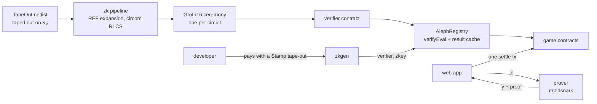

<p align="center"><b>English</b> | <a href="README.zh-CN.md">简体中文</a></p>

<p align="center">
  <picture>
    <source media="(prefers-color-scheme: dark)" srcset="assets/logo-paper.svg">
    
  </picture>
</p>

<h3 align="center">TapeOut's ZK coprocessor: any-size circuits, verified on chain.</h3>

<p align="center">Verifying circuit inference costs a thousandth as much, making on-chain AI possible.</p>

<p align="center">
  
  
  
  
  
  
</p>

<p align="center"><b><a href="https://alephtape.xyz">Website</a> | <a href="https://alephtape.xyz/play/">Play</a> | <a href="https://www.oklink.com/x-layer/address/0xb00E17789f905234F1890C22E6C01015c10d2f54">Processor ℵ₀</a></b></p>

<p align="center"><a href="#what-it-does">What it does</a> | <a href="#six-games-seven-ais">Six games</a> | <a href="#architecture">Architecture</a> | <a href="#run-it-locally">Run it locally</a> | <a href="#deployment-x-layer-mainnet-chain-196">Deployment</a> | <a href="#security">Security</a> | <a href="#roadmap">Roadmap</a></p>

<p align="center"><code>ℵ₀ 0xb00E17789f905234F1890C22E6C01015c10d2f54</code></p>

An entry to the TapeOut Genesis Transistor Hackathon, live on X Layer mainnet.

## What it does

TapeOut runs a circuit gate by gate on chain (`eval`), so big circuits do not fit in a block. Our digit-recognition neural net flattens to 161,220 gates; a direct `eval` costs **396,410,201 gas**, 1.89 blocks.

AlephTape turns "circuit C outputs y on input x" into a Groth16 proof. One `verifyEval` checks it on chain and caches the result for any contract to read.

| | gas |
|---|---|
| Direct `eval` of the digit net (mainnet fork) | 396,410,201 |
| AlephTape `verifyEval` (X Layer mainnet) | 296,826 |
| Ratio | **about 1/1,335** |

The circuit stays the public, immutable TapeOut circuit; AlephTape takes over the ones a block cannot hold.

## Six games, seven AIs

Every AI is a TapeOut circuit taped out on ℵ₀. Every move is proven in zero knowledge; the contract replays the game, checks each move and keeps the score, in one transaction.

| Game | AI | Direct eval per move | One game settled (X Layer mainnet) |
|---|---|---|---|
| Digit recognition | digit net | 396M gas | 296,826 |
| Gomoku (human vs AI) | ℵ-1 | ~351M | 1,303,714 |
| Snake | snake | ~359M | 6,702,505 |
| 2048 | 2048 | ~430M | 18,753,289 |
| Pixel bird | flappy | ~353M | 8,155,199 |
| AI vs AI (Elo) | ℵ-2, ℵ-3, ℵ-1 | ~350M | 3,509,643 |

AI vs AI is open: any registered circuit with the gomoku interface can enter.

**Neuron reuse.** Only the generic neurons burn transistors (7 tape-outs, 8,038 transistors). The 34 layer and top circuits REF them with the weights tied to constants and burn none, so new weights make a new AI.

## Architecture



- **`zk/`** expands a netlist and its REF sub-circuits into one flat circuit, compiles it to R1CS (one constraint per NAND), runs the ceremony and exports the verifier.
- **`contracts/`** AlephRegistry binds (processor, circuit id, verifier); a passing `verifyEval` caches `y` for `keccak(x)`: prove once, reuse forever.
- **`zk/zkgen.py`** lets anyone make their own ℵ₀ circuit verifiable, free; the site also runs it as a hosted service, paid by taping out a 152-NAND Stamp on ℵ₀.
- **`zk/ceremony/`** the ceremony transcript of every circuit we registered.
- The prover simulates y and proves it in about 0.5 s. It cannot forge a proof; it only affects availability.

## Run it locally

```bash
git submodule update --init && cd contracts && forge test   # real Groth16 proofs included
python3 zk/zkgen.py --rpc https://rpc.xlayer.tech --processor <addr> --circuit <id> --out <dir>   # see zk/README.md
```

## Deployment (X Layer mainnet, chain 196)

Processor ℵ₀: AlephTape / ALEPH0, supply 21,000,000 transistors at 0.000066 OKB, set at deployment.

| | Address |
|---|---|
| ℵ₀ processor (factory #287) | [`0xb00E17789f905234F1890C22E6C01015c10d2f54`](https://www.oklink.com/x-layer/address/0xb00E17789f905234F1890C22E6C01015c10d2f54) |
| Transistors | [`0xb6C399a31e976C6d497EC66570238159432D09cD`](https://www.oklink.com/x-layer/address/0xb6C399a31e976C6d497EC66570238159432D09cD) |
| createCPU tx | [`0xb4c12546…62d3`](https://www.oklink.com/x-layer/tx/0xb4c12546fe32aa80f8d7326bfbf6efdd7d1823f55197cac8516f8fa5417e62d3) (2026-10-07) |
| First circuit taped out | [`0xad86bf18…b8c2`](https://www.oklink.com/x-layer/tx/0xad86bf1853c0b2fe7759254c903aad242a9e381077c1e650eb410b6c92edb8c2) (TapeID `1.2.287`) |
| Deployer | [`0x65E9483960015EBDDC9EE37b184211E2802d9bcd`](https://www.oklink.com/x-layer/address/0x65E9483960015EBDDC9EE37b184211E2802d9bcd) |
| AlephRegistry | [`0x5f385e5621a4330BA959a3041159A6dB2AB1ddda`](https://www.oklink.com/x-layer/address/0x5f385e5621a4330BA959a3041159A6dB2AB1ddda) |
| AiJudge | [`0xB955bFb1FE228f3447f3387aa034eB975c034aCE`](https://www.oklink.com/x-layer/address/0xB955bFb1FE228f3447f3387aa034eB975c034aCE) |
| AlephGomoku | [`0xECA8B1eb49d6a8CaA0CaD5B80E81254260ACD467`](https://www.oklink.com/x-layer/address/0xECA8B1eb49d6a8CaA0CaD5B80E81254260ACD467) |
| AlephSnake | [`0xa8754fA49671d69fF6954C4309E9575C12B9cfa0`](https://www.oklink.com/x-layer/address/0xa8754fA49671d69fF6954C4309E9575C12B9cfa0) |
| AlephGame2048 | [`0xe125eA6c0EF688c283CC074CF719A437dF0E92Eb`](https://www.oklink.com/x-layer/address/0xe125eA6c0EF688c283CC074CF719A437dF0E92Eb) |
| AlephFlappy | [`0x0cACBf6e3E0619Fb7A96E9dE1D31062b6a897cDb`](https://www.oklink.com/x-layer/address/0x0cACBf6e3E0619Fb7A96E9dE1D31062b6a897cDb) |
| AlephGomokuArena | [`0xCAEC34ba7FF7C48096b738092D0aFF005579000c`](https://www.oklink.com/x-layer/address/0xCAEC34ba7FF7C48096b738092D0aFF005579000c) |

TapeIDs (`circuit.2.287`): digit net `11.2.287`, ℵ-1 `17.2.287`, 2048 `21.2.287`, snake `25.2.287`, pixel bird `29.2.287`, ℵ-2 `35.2.287`, ℵ-3 `41.2.287`.

## Security

- **A result is as trustworthy as its verifier.** Anyone can check a verifier against its circuit: rebuild the R1CS from the on-chain netlists, `snarkjs zkey verify` the published zkey, export the verifier and compare bytecode (`zk/zkgen.py` rebuilds any registered circuit from the chain; `zk/ceremony.cjs verify` checks a transcript).
- **Ceremony:** phase 1 is the multi-party PSE perpetual powers of tau; phase 2 is one contribution per circuit plus an X Layer block beacon, transcripts in `zk/ceremony/`. Anyone can add a contribution and register a new key.
- **TapeOut's factory is upgradeable;** AlephTape reads the processor only at registration, and verification and settlement never call TapeOut, so an upgrade cannot change proven results.
- **The contracts hold no funds.**

## Roadmap

- ZK eval as a TapeOut protocol proposal (TAP).
- Community ceremony contributions, from 1-of-1 to 1-of-N.
- ℵ₁, the next processor, once ℵ₀ is minted out.
- Private inputs: prove you know an input that satisfies a circuit without revealing it.
