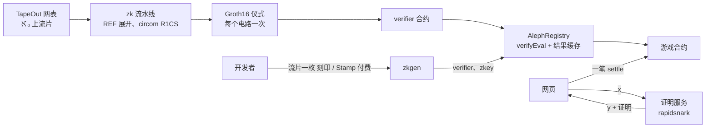

<p align="center"><a href="README.md">English</a> | <b>简体中文</b></p>

<p align="center">
  <picture>
    <source media="(prefers-color-scheme: dark)" srcset="assets/logo-paper.svg">
    
  </picture>
</p>

<h3 align="center">TapeOut 的 ZK 协处理器：任意大小的电路，在链上验证。</h3>

<p align="center">电路推理验证成本降至千分之一，让链上 AI 成为可能。</p>

<p align="center">
  
  
  
  
  
  
</p>

<p align="center"><b><a href="https://alephtape.xyz">网站</a> | <a href="https://alephtape.xyz/play/">试玩</a> | <a href="https://www.oklink.com/x-layer/address/0xb00E17789f905234F1890C22E6C01015c10d2f54">处理器 ℵ₀</a></b></p>

<p align="center"><a href="#它做什么">它做什么</a> | <a href="#六个游戏七个-ai">六个游戏</a> | <a href="#架构">架构</a> | <a href="#本地运行">本地运行</a> | <a href="#部署x-layer-主网chain-196">部署</a> | <a href="#安全">安全</a> | <a href="#路线图">路线图</a></p>

<p align="center"><code>ℵ₀ 0xb00E17789f905234F1890C22E6C01015c10d2f54</code></p>

TapeOut Genesis Transistor Hackathon 参赛作品，已上线 X Layer 主网。

## 它做什么

TapeOut 在链上逐门求值（`eval`），电路一大就装不进一个区块。我们的手写数字神经网络展开后 161,220 个门，直接 `eval` 要 **396,410,201 gas**，是 1.89 个区块。

AlephTape 把“电路 C 在输入 x 上输出 y”变成一份 Groth16 证明，链上一笔 `verifyEval` 就能确认，结果缓存起来给任何合约读。

| | gas |
|---|---|
| 数字识别网络直接 `eval`（主网分叉实测） | 396,410,201 |
| AlephTape `verifyEval`（X Layer 主网实测） | 296,826 |
| 比例 | **约 1/1,335** |

电路仍然是 TapeOut 上那颗公开、不可改的电路；AlephTape 只接手区块装不下的电路。

## 六个游戏，七个 AI

每个 AI 都是流片在 ℵ₀ 上的 TapeOut 电路，每一步都被零知识证明，合约在链上重放、判定、计分，一局一笔交易。

| 游戏 | AI | 每一步直接 eval | 一局结算（X Layer 主网实测） |
|---|---|---|---|
| 数字识别 | 数字识别网络 | 3.96 亿 gas | 296,826 |
| 五子棋（人对 AI） | ℵ-1 | 约 3.51 亿 | 1,303,714 |
| 贪吃蛇 | snake | 约 3.59 亿 | 6,702,505 |
| 2048 | 2048 | 约 4.3 亿 | 18,753,289 |
| 像素小鸟 | flappy | 约 3.53 亿 | 8,155,199 |
| AI 对棋（Elo） | ℵ-2、ℵ-3、ℵ-1 | 约 3.5 亿 | 3,509,643 |

AI 对棋无需许可：任何登记过、符合五子棋接口的电路都能报名。

**神经元复用。** 只有通用神经元烧晶体管（7 次流片，8,038 颗）。34 个层电路和顶层电路用 REF 引用神经元、权重接常量，0 颗；换一套权重就是一个新 AI。

## 架构



- **`zk/`** 把网表和它 REF 的子电路展开成一个电路，编译成 R1CS（每个 NAND 一个约束），跑仪式，导出 verifier。
- **`contracts/`** AlephRegistry 绑定（处理器，电路号，verifier）；`verifyEval` 通过后按 `keccak(x)` 缓存 y：证明一次，永久复用。
- **`zk/zkgen.py`** 让任何人把自己在 ℵ₀ 上的电路变成可验证电路，免费；网站上也提供托管版，在 ℵ₀ 上流片一枚 152 个 NAND 的 刻印 / Stamp 付费。
- **`zk/ceremony/`** 我们登记的每个电路的仪式记录。
- 证明服务仿真算出 y，约 0.5 秒出证明。它伪造不了证明，只影响可用性。

## 本地运行

```bash
git submodule update --init && cd contracts && forge test   # 含真实 Groth16 证明
python3 zk/zkgen.py --rpc https://rpc.xlayer.tech --processor <地址> --circuit <电路号> --out <目录>   # 见 zk/README.md
```

## 部署（X Layer 主网，chain 196）

处理器 ℵ₀：AlephTape / ALEPH0，部署时设定供给 21,000,000 颗晶体管，单价 0.000066 OKB。

| | 地址 |
|---|---|
| ℵ₀ 处理器（工厂第 287 号） | [`0xb00E17789f905234F1890C22E6C01015c10d2f54`](https://www.oklink.com/x-layer/address/0xb00E17789f905234F1890C22E6C01015c10d2f54) |
| 晶体管合约 | [`0xb6C399a31e976C6d497EC66570238159432D09cD`](https://www.oklink.com/x-layer/address/0xb6C399a31e976C6d497EC66570238159432D09cD) |
| createCPU 交易 | [`0xb4c12546…62d3`](https://www.oklink.com/x-layer/tx/0xb4c12546fe32aa80f8d7326bfbf6efdd7d1823f55197cac8516f8fa5417e62d3)（2026-10-07） |
| 首个流片电路 | [`0xad86bf18…b8c2`](https://www.oklink.com/x-layer/tx/0xad86bf1853c0b2fe7759254c903aad242a9e381077c1e650eb410b6c92edb8c2)（TapeID `1.2.287`） |
| 部署钱包 | [`0x65E9483960015EBDDC9EE37b184211E2802d9bcd`](https://www.oklink.com/x-layer/address/0x65E9483960015EBDDC9EE37b184211E2802d9bcd) |
| AlephRegistry | [`0x5f385e5621a4330BA959a3041159A6dB2AB1ddda`](https://www.oklink.com/x-layer/address/0x5f385e5621a4330BA959a3041159A6dB2AB1ddda) |
| AiJudge | [`0xB955bFb1FE228f3447f3387aa034eB975c034aCE`](https://www.oklink.com/x-layer/address/0xB955bFb1FE228f3447f3387aa034eB975c034aCE) |
| AlephGomoku | [`0xECA8B1eb49d6a8CaA0CaD5B80E81254260ACD467`](https://www.oklink.com/x-layer/address/0xECA8B1eb49d6a8CaA0CaD5B80E81254260ACD467) |
| AlephSnake | [`0xa8754fA49671d69fF6954C4309E9575C12B9cfa0`](https://www.oklink.com/x-layer/address/0xa8754fA49671d69fF6954C4309E9575C12B9cfa0) |
| AlephGame2048 | [`0xe125eA6c0EF688c283CC074CF719A437dF0E92Eb`](https://www.oklink.com/x-layer/address/0xe125eA6c0EF688c283CC074CF719A437dF0E92Eb) |
| AlephFlappy | [`0x0cACBf6e3E0619Fb7A96E9dE1D31062b6a897cDb`](https://www.oklink.com/x-layer/address/0x0cACBf6e3E0619Fb7A96E9dE1D31062b6a897cDb) |
| AlephGomokuArena | [`0xCAEC34ba7FF7C48096b738092D0aFF005579000c`](https://www.oklink.com/x-layer/address/0xCAEC34ba7FF7C48096b738092D0aFF005579000c) |

TapeID（`电路号.2.287`）：数字识别 `11.2.287`，ℵ-1 `17.2.287`，2048 `21.2.287`，贪吃蛇 `25.2.287`，像素小鸟 `29.2.287`，ℵ-2 `35.2.287`，ℵ-3 `41.2.287`。

## 安全

- **结果可信的前提是 verifier 可信。** 任何人都能核对 verifier 和电路是否对应：从链上网表重建 R1CS，对公开的 zkey 跑 `snarkjs zkey verify`，导出 verifier 和链上字节码比对（`zk/zkgen.py` 可从链上重建任何已登记电路，`zk/ceremony.cjs verify` 核对仪式记录）。
- **仪式：** phase 1 是 PSE 多方 perpetual powers of tau；phase 2 每个电路一次贡献加 X Layer 区块信标，记录在 `zk/ceremony/`。任何人都可以追加贡献、登记新 key。
- **TapeOut 工厂可升级；** AlephTape 只在登记时读处理器，验证和结算从不调用 TapeOut，工厂升级改不了已证明的结果。
- **合约不持有资金。**

## 路线图

- 把 ZK eval 写成 TapeOut 协议提案（TAP）。
- 社区追加仪式贡献，从 1-of-1 变成 1-of-N。
- ℵ₀ 铸满后开下一代处理器 ℵ₁。
- 输入保密：证明“我知道一个满足电路的输入”而不公开它。
